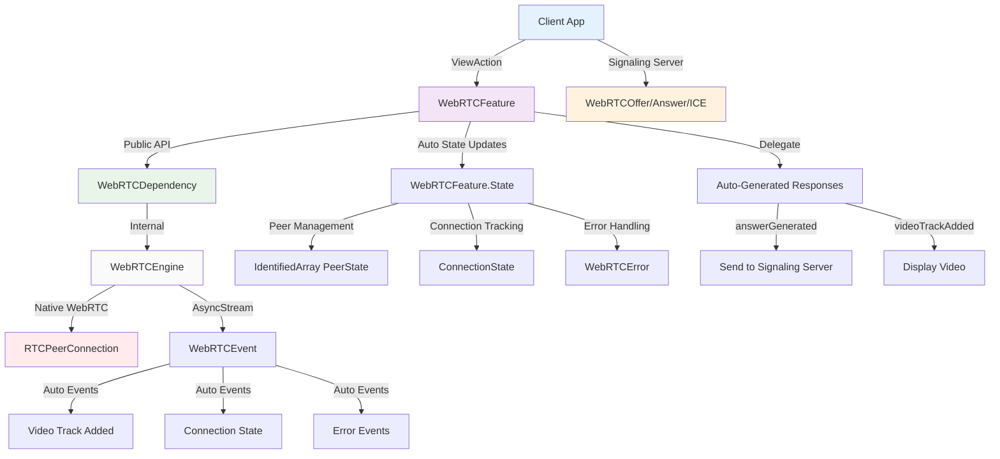
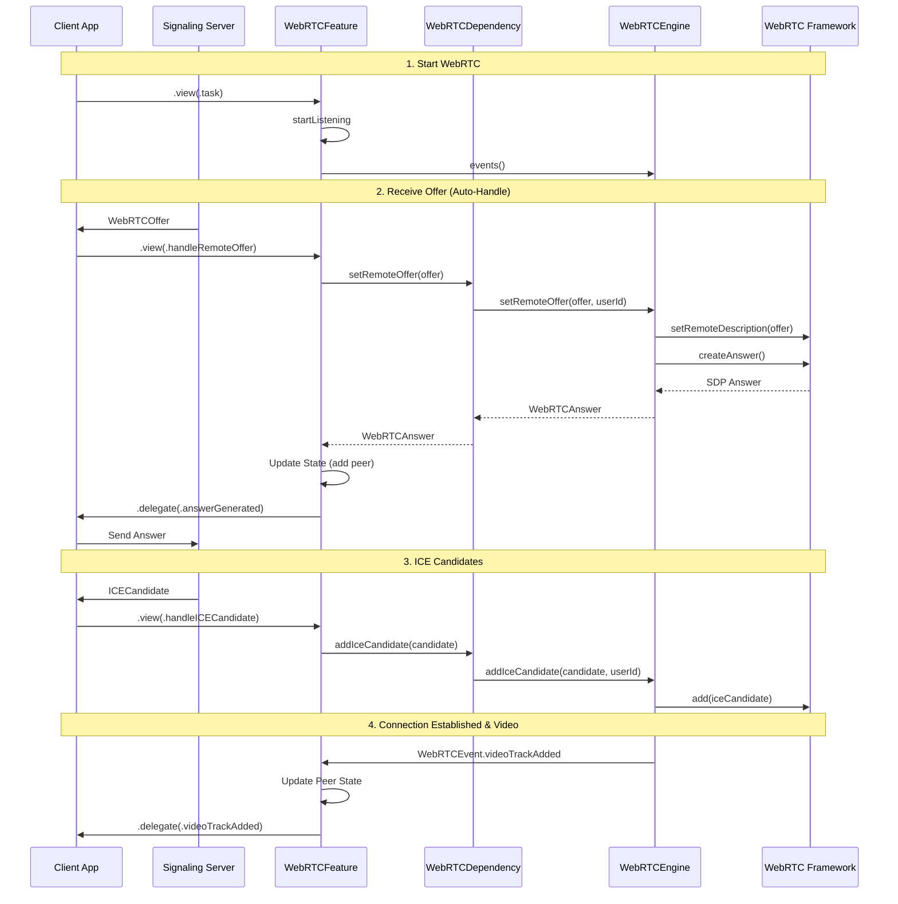

# WebRTCCore

A simplified Swift Package for receiving WebRTC connections with The Composable Architecture (TCA), designed for iOS and macOS applications.

## Features

- 🎯 **Receive-Only Focus**: Optimized for receiving WebRTC video/audio streams
- 🤖 **Automated Flow**: Auto-handles connection setup and SDP exchange
- 🏗️ **TCA Integration**: Clean integration with The Composable Architecture
- 🔄 **AsyncStream Events**: Modern async/await event handling
- 🧪 **Swift Testing**: Comprehensive test coverage with Swift Testing framework
- 🚀 **Swift 6.0**: Full Swift 6 strict concurrency compliance
- 📱 **Multi-Platform**: iOS 17+ and macOS 14+ support
- 🔌 **Standard Signaling**: Uses standardized signaling models for interoperability

## Architecture



## Core Components

### 🎯 WebRTCFeature
The main TCA reducer with simplified receive-only API:
- **5 Essential ViewActions**: `task`, `handleRemoteOffer`, `handleICECandidate`, `disconnectPeer`, `dismissError`
- **Simplified Parameters**: No redundant userId parameters - extracted from model properties
- **Automated Flow**: Receiving offers automatically creates connections and generates answers
- **Delegate Events**: Auto-generated answers, video tracks, and connection updates
- **State Management**: Tracks connected peers with automatic state updates

### 🔧 WebRTCDependency (Public API)
Clean TCA dependency interface using standardized signaling models:
- **Simplified API**: Methods only require model parameters (no redundant userId)
- **Signaling Models**: Uses `WebRTCOffer`, `WebRTCAnswer`, `ICECandidate` with explicit `from`/`to` properties
- **Automatic Conversion**: Internal conversion between signaling models and WebRTC types
- **Test Support**: Mock implementations for comprehensive testing
- **Sendable Compliance**: Full Swift 6 concurrency safety

### 🔒 WebRTCEngine (Internal)
Internal actor-based engine (not exposed to clients):
- Peer connection lifecycle management
- SDP negotiation handling
- ICE candidate processing
- Media track management
- Event streaming via AsyncStream

### 📊 Signaling Models
Standard interoperable data models with explicit direction:
- `WebRTCOffer`: SDP offer with `from`/`to` properties for clear message routing
- `WebRTCAnswer`: SDP answer with `from`/`to` properties for clear message routing
- `ICECandidate`: ICE candidate with `from`/`to` properties for clear message routing
- `VideoTrackInfo`: Video track information with Sendable compliance
- `WebRTCEvent`: Unified event system for automated WebRTC operations

## Installation

### Swift Package Manager

Add WebRTCCore to your `Package.swift`:

```swift
dependencies: [
    .package(url: "https://github.com/your-org/WebRTCCore", from: "1.0.0")
]
```

Or add it through Xcode:
1. File → Add Package Dependencies
2. Enter the repository URL
3. Select version requirements

## Usage

### Basic Setup

```swift
import ComposableArchitecture
import WebRTCCore

// 1. Add to your parent feature's state
struct AppFeature: Reducer {
    struct State {
        var webRTC = WebRTCFeature.State()
    }
    
    enum Action {
        case webRTC(WebRTCFeature.Action)
        case signalingMessage(SignalingMessage) // Your signaling system
    }
    
    var body: some ReducerOf<Self> {
        Scope(state: \.webRTC, action: \.webRTC) {
            WebRTCFeature()
        }
        Reduce { state, action in
            switch action {
            // Auto-generated answer from WebRTC - send to signaling server
            case let .webRTC(.delegate(.answerGenerated(sdp, userId))):
                let answer = WebRTCAnswer(sdp: sdp, type: "answer", from: "current-user", to: userId, videoSource: "")
                return sendToSignalingServer(answer, userId: userId)
                
            // ICE candidate generated - send to signaling server  
            case let .webRTC(.delegate(.iceCandidateGenerated(candidate, sdpMLineIndex, sdpMid, userId))):
                let iceCandidate = ICECandidate(
                    type: "ice", from: "current-user", to: userId,
                    candidate: ICECandidate.Candidate(
                        candidate: candidate, sdpMLineIndex: sdpMLineIndex, sdpMid: sdpMid
                    )
                )
                return sendToSignalingServer(iceCandidate, userId: userId)
                
            // Video track added - display in UI
            case let .webRTC(.delegate(.videoTrackAdded(trackInfo))):
                print("📺 Video track added for user: \(trackInfo.userId)")
                return .none
                
            // Handle incoming signaling messages
            case let .signalingMessage(.offer(offer)):
                // Automatically handle offer and generate answer
                return .send(.webRTC(.view(.handleRemoteOffer(offer))))
                
            case let .signalingMessage(.iceCandidate(candidate)):
                return .send(.webRTC(.view(.handleICECandidate(candidate))))
                
            default:
                return .none
            }
        }
    }
}
```

### SwiftUI Integration

Create your custom UI (WebRTCView is internal):

```swift
import SwiftUI
import ComposableArchitecture
import WebRTCCore

struct VideoCallView: View {
    @Bindable var store: StoreOf<AppFeature>
    
    var body: some View {
        VStack {
            // Connection status
            HStack {
                Circle()
                    .fill(store.webRTC.isListening ? .green : .gray)
                    .frame(width: 12, height: 12)
                Text("\(store.webRTC.connectedPeers.count) connected")
            }
            
            // Video feeds
            LazyVGrid(columns: [GridItem(.flexible()), GridItem(.flexible())]) {
                ForEach(store.webRTC.connectedPeers) { peer in
                    if let videoTrack = peer.videoTrack {
                        VideoView(track: videoTrack.track) // Your video renderer
                            .aspectRatio(16/9, contentMode: .fit)
                            .overlay(alignment: .bottomLeading) {
                                Text(peer.id)
                                    .padding(4)
                                    .background(.black.opacity(0.7))
                                    .foregroundColor(.white)
                                    .font(.caption)
                            }
                    }
                }
            }
            
            // Error display
            if let error = store.webRTC.error {
                HStack {
                    Image(systemName: "exclamationmark.triangle")
                    Text(error.localizedDescription)
                    Button("Dismiss") {
                        store.send(.webRTC(.view(.dismissError)))
                    }
                }
                .foregroundColor(.red)
            }
        }
        .task {
            // Start WebRTC listening
            store.send(.webRTC(.view(.task)))
        }
    }
}
```

### Complete Flow Example

```swift
// 1. Start WebRTC
store.send(.webRTC(.view(.task)))

// 2. When you receive an offer from signaling server
let offer = WebRTCOffer(sdp: sdpString, type: "offer", from: userId, to: "current-user", videoSource: "camera")
store.send(.webRTC(.view(.handleRemoteOffer(offer))))

// 3. WebRTC automatically generates answer - send it back via signaling
// (handled in your reducer's delegate case)

// 4. When you receive ICE candidates from signaling server
let candidate = ICECandidate(
    type: "ice", from: userId, to: "current-user",
    candidate: ICECandidate.Candidate(candidate: candidateString, sdpMLineIndex: 0, sdpMid: "0")
)
store.send(.webRTC(.view(.handleICECandidate(candidate))))

// 5. Video tracks are automatically added to state and delegate events fired
```

### Testing

WebRTCCore uses Swift Testing for comprehensive test coverage:

```swift
import Testing
import ComposableArchitecture
@testable import WebRTCCore

@MainActor
struct MyWebRTCTests {
    @Test
    func handleRemoteOffer_automaticallyCreatesConnectionAndSendsAnswer() async {
        let mockOffer = WebRTCOffer(
            sdp: "mock-offer-sdp",
            type: "offer", 
            from: "user123",
            to: "current-user",
            videoSource: "camera"
        )
        let mockAnswer = WebRTCAnswer(
            sdp: "mock-answer-sdp",
            type: "answer",
            from: "current-user",
            to: "user123", 
            videoSource: "camera"
        )
        
        let store = TestStore(initialState: WebRTCFeature.State()) {
            WebRTCFeature()
        } withDependencies: {
            $0.webRTCEngine.setRemoteOffer = { _ in mockAnswer }
        }
        
        await store.send(\.view, .handleRemoteOffer(mockOffer))
        await store.receive(.remoteOfferHandled("user123", mockAnswer)) {
            $0.connectedPeers = [
                WebRTCFeature.PeerState(id: "user123", connectionState: .connecting)
            ]
        }
        await store.receive(\.delegate, .answerGenerated(sdp: "mock-answer-sdp", userId: "user123"))
    }
}
```

## Requirements

- iOS 17.0+ / macOS 14.0+
- Swift 6.0+
- Xcode 16.0+

## Dependencies

- [WebRTC](https://github.com/stasel/WebRTC): WebRTC framework
- [ComposableArchitecture](https://github.com/pointfreeco/swift-composable-architecture): TCA framework
- [CustomDump](https://github.com/pointfreeco/swift-custom-dump): Testing utilities

## Development

### Running Tests

```bash
swift test
```

### Code Formatting

```bash
swift-format --in-place Sources/ Tests/
```

### Building

```bash
swift build
```

## Event Flow



## Contributing

1. Fork the repository
2. Create a feature branch: `git checkout -b feature/amazing-feature`
3. Follow the coding standards in `CLAUDE.md`
4. Ensure all tests pass: `swift test`
5. Format code: `swift-format --in-place Sources/ Tests/`
6. Commit changes: `git commit -m 'feat: add amazing feature'`
7. Push to branch: `git push origin feature/amazing-feature`
8. Open a Pull Request

## License

This project is licensed under the MIT License - see the [LICENSE](LICENSE) file for details.

## Acknowledgments

- Built with [The Composable Architecture](https://github.com/pointfreeco/swift-composable-architecture)
- WebRTC functionality powered by [WebRTC Framework](https://github.com/stasel/WebRTC)
- Follows Swift 6 concurrency best practices