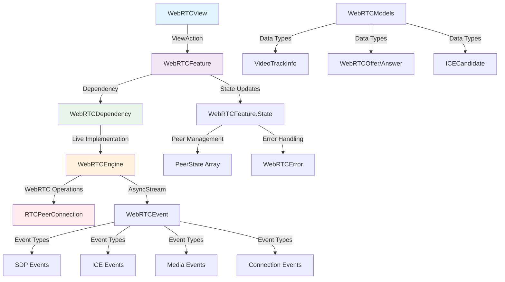
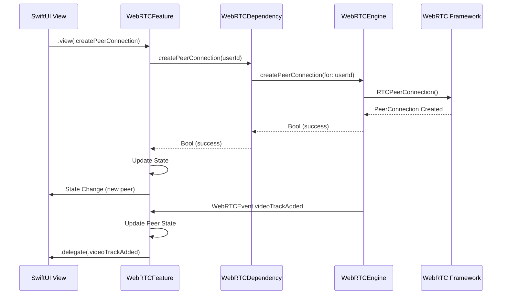

# WebRTCCore

A modern Swift Package for WebRTC integration with The Composable Architecture (TCA), designed for iOS and macOS applications.

## Features

- 🏗️ **TCA Integration**: Full integration with The Composable Architecture pattern
- 🎥 **WebRTC Support**: Complete peer-to-peer video/audio communication
- 🔄 **AsyncStream Events**: Modern async/await event handling
- 🧪 **Swift Testing**: Comprehensive test coverage with Swift Testing framework
- 🚀 **Swift 6.0**: Full Swift 6 strict concurrency compliance
- 📱 **Multi-Platform**: iOS 17+ and macOS 14+ support

## Architecture



## Core Components

### 🎯 WebRTCFeature
The main TCA reducer that manages WebRTC state and actions:
- **State Management**: Tracks connected peers and connection states
- **ViewAction Pattern**: Clean separation of user actions from internal actions
- **Delegate Pattern**: Event propagation to parent features
- **Error Handling**: Custom WebRTC error types with proper handling

### 🔧 WebRTCEngine
Actor-based WebRTC engine that handles:
- Peer connection management
- SDP offer/answer generation
- ICE candidate handling
- Media track management
- Event streaming via AsyncStream

### 📡 WebRTCDependency
TCA dependency client for:
- **Test Support**: Mock implementations for testing
- **Live Implementation**: Real WebRTC operations
- **Sendable Compliance**: Swift 6 concurrency safe
- **Modern API**: AsyncStream-based event handling

### 📊 WebRTCModels
Comprehensive data models including:
- `VideoTrackInfo`: Video track information with Sendable compliance
- `WebRTCEvent`: Unified event system for all WebRTC operations
- `WebRTCError`: Typed error handling
- Signaling models for SDP and ICE candidate exchange

## Installation

### Swift Package Manager

Add WebRTCCore to your `Package.swift`:

```swift
dependencies: [
    .package(url: "https://github.com/your-org/WebRTCCore", from: "1.0.0")
]
```

Or add it through Xcode:
1. File → Add Package Dependencies
2. Enter the repository URL
3. Select version requirements

## Usage

### Basic Setup

```swift
import ComposableArchitecture
import WebRTCCore

// 1. Add to your parent feature's state
struct AppFeature: Reducer {
    struct State {
        var webRTC = WebRTCFeature.State()
    }
    
    enum Action {
        case webRTC(WebRTCFeature.Action)
    }
    
    var body: some ReducerOf<Self> {
        Scope(state: \.webRTC, action: \.webRTC) {
            WebRTCFeature()
        }
        Reduce { state, action in
            switch action {
            case .webRTC(.delegate(.offerGenerated(let sdp, let userId))):
                // Handle offer generation
                return .none
                
            case .webRTC(.delegate(.videoTrackAdded(let trackInfo))):
                // Handle video track addition
                return .none
                
            default:
                return .none
            }
        }
    }
}
```

### Custom UI Integration

Since WebRTCView is excluded from the package, create your own UI:

```swift
import SwiftUI
import ComposableArchitecture
import WebRTCCore

struct CustomWebRTCView: View {
    let store: StoreOf<WebRTCFeature>
    
    var body: some View {
        VStack {
            // Your custom UI here
            Button("Create Connection") {
                store.send(.view(.createPeerConnection(userId: "user123")))
            }
            
            ForEach(store.connectedPeers) { peer in
                PeerConnectionView(peer: peer)
            }
        }
        .task {
            store.send(.view(.task))
        }
    }
}
```

### Testing

WebRTCCore uses Swift Testing for comprehensive test coverage:

```swift
import Testing
import ComposableArchitecture
@testable import WebRTCCore

@MainActor
struct MyWebRTCTests {
    @Test
    func webRTCConnection() async {
        let store = TestStore(initialState: WebRTCFeature.State()) {
            WebRTCFeature()
        } withDependencies: {
            $0.webRTCEngine.createPeerConnection = { _ in true }
        }
        
        await store.send(.view(.createPeerConnection(userId: "test")))
        await store.receive(.createPeerConnectionResult("test", true)) {
            $0.connectedPeers = [
                WebRTCFeature.PeerState(id: "test", connectionState: .connecting)
            ]
        }
    }
}
```

## Requirements

- iOS 17.0+ / macOS 14.0+
- Swift 6.0+
- Xcode 16.0+

## Dependencies

- [WebRTC](https://github.com/stasel/WebRTC): WebRTC framework
- [ComposableArchitecture](https://github.com/pointfreeco/swift-composable-architecture): TCA framework
- [CustomDump](https://github.com/pointfreeco/swift-custom-dump): Testing utilities

## Development

### Running Tests

```bash
swift test
```

### Code Formatting

```bash
swift-format --in-place Sources/ Tests/
```

### Building

```bash
swift build
```

## Event Flow



## Contributing

1. Fork the repository
2. Create a feature branch: `git checkout -b feature/amazing-feature`
3. Follow the coding standards in `CLAUDE.md`
4. Ensure all tests pass: `swift test`
5. Format code: `swift-format --in-place Sources/ Tests/`
6. Commit changes: `git commit -m 'feat: add amazing feature'`
7. Push to branch: `git push origin feature/amazing-feature`
8. Open a Pull Request

## License

This project is licensed under the MIT License - see the [LICENSE](LICENSE) file for details.

## Acknowledgments

- Built with [The Composable Architecture](https://github.com/pointfreeco/swift-composable-architecture)
- WebRTC functionality powered by [WebRTC Framework](https://github.com/stasel/WebRTC)
- Follows Swift 6 concurrency best practices